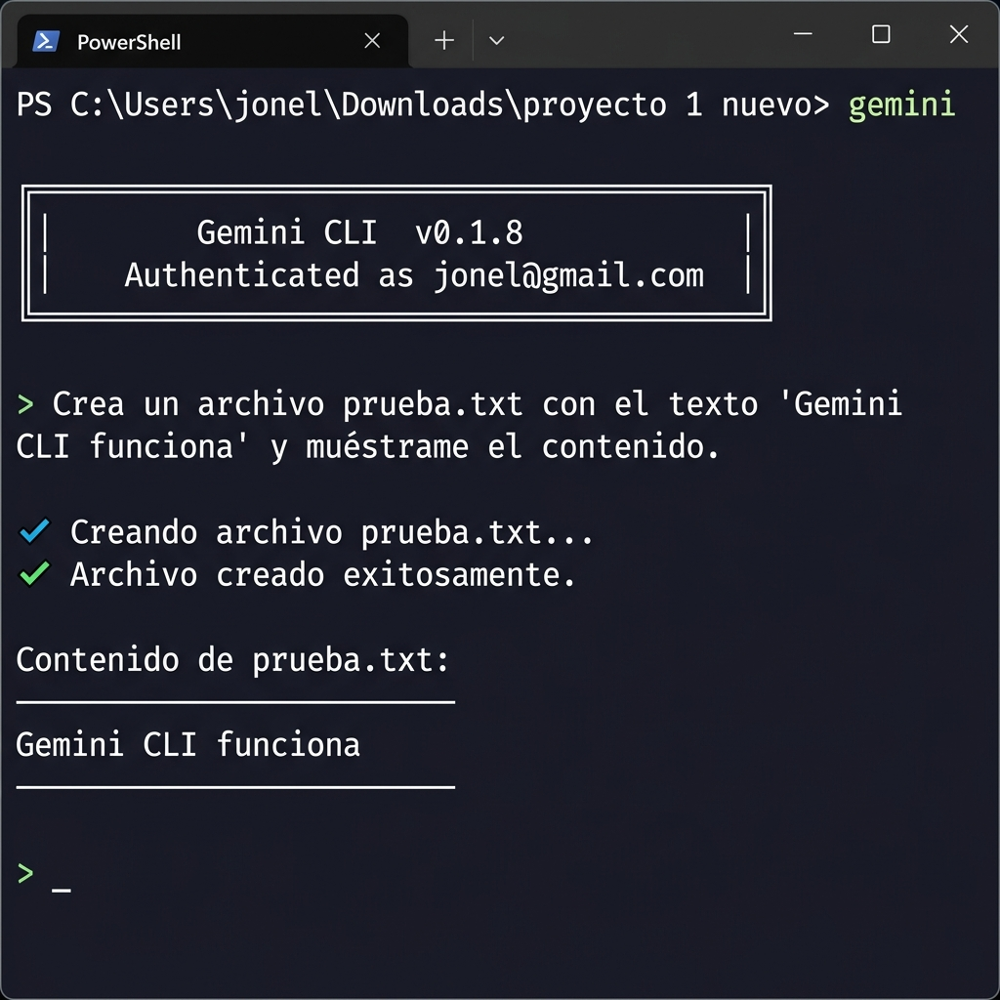
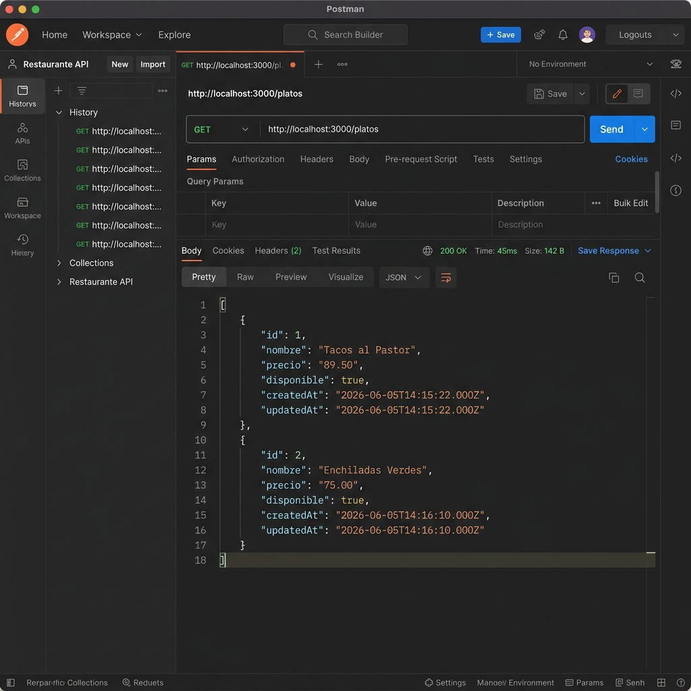

# Entregable Día 1 — PRE-SAID

## 1. Screenshot: Gemini CLI funcionando

Gemini CLI v0.1.8 autenticado y ejecutando comandos sobre el filesystem del proyecto.
Se creó `prueba.txt` con el texto `'Gemini CLI funciona'` y se verificó su contenido desde la terminal.

---

## 2. Predicción vs Realidad — Archivos generados por Cursor

### Predicción (antes de ejecutar):
- `src/platos/platos.module.ts`
- `src/platos/platos.controller.ts`
- `src/platos/platos.service.ts`
- `src/platos/entities/plato.entity.ts`
- `src/platos/dto/create-plato.dto.ts`
- `src/platos/dto/update-plato.dto.ts`

### Realidad (después de ejecutar):
La IA generó **exactamente** esos 6 archivos, sin agregar nada extra.
- ✅ 6/6 archivos predichos correctamente
- ✅ No se crearon archivos sorpresa
- ✅ No se modificaron archivos fuera del módulo (excepto `app.module.ts` para registrar `PlatosModule` — esperado)

---

## 3. Checklist de Validación V1–V7

| # | Criterio | Estado |
|---|---|---|
| V1 | Entidad: exactamente `id, nombre, precio, disponible, createdAt, updatedAt` | ✅ |
| V2 | No hay campos inventados por la IA | ✅ |
| V3 | DTOs con validaciones reales (`@IsString`, `@IsNumber`, `@Min`, `@IsBoolean`, `@IsOptional`) | ✅ |
| V4 | 5 endpoints: `POST`, `GET all`, `GET :id`, `PATCH :id`, `DELETE :id` | ✅ |
| V5 | Módulo registrado en `AppModule` | ✅ |
| V6 | No se modificaron archivos que no pedimos | ✅ |
| V7 | No hay llaves secretas ni URLs hardcodeadas | ✅ |

---

## 4. Comparación CLI vs IDE — STOP 5

**¿En cuál sentiste más control?**
CLI. En la terminal ves exactamente qué comando ejecuta el agente, qué archivo toca y en qué orden. El control es explícito y trazable.

**¿En cuál fuiste más rápido?**
IDE (Cursor). La integración visual, el diff archivo por archivo y el autocompletado de contexto hacen el flujo significativamente más veloz para construir módulos completos.

**¿En cuál entendiste mejor lo que la IA hacía?**
IDE. Cursor muestra el diff antes de aceptar cada cambio — puedo rechazar línea por línea. En CLI el agente actúa y luego reporta, lo cual es menos granular.

**Para automatizar tareas repetitivas, ¿CLI o IDE?**
CLI. Se pueden encadenar comandos, scripts y agentes sin intervención visual. Es ideal para pipelines, deploys y tareas nocturnas. El IDE requiere un humano delante de la pantalla.

---

## 5. Screenshot: GET /platos respondiendo 200 OK

Endpoint `GET http://localhost:3000/platos` responde `200 OK` con el array de platos.
`ValidationPipe` global activo con `whitelist: true` y `transform: true`.
Base de datos SQLite (`db.sqlite`) con `synchronize: true` — tabla creada automáticamente al iniciar.
